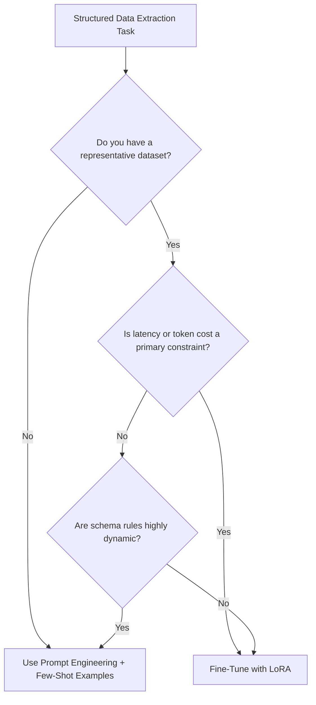

# Llama 3.2 Document Extractor — Fine-Tuning Report

This report evaluates and compares **Supervised Fine-Tuning (SFT) via LoRA** and **Prompt Engineering** for extracting structured JSON data from invoices and purchase orders using the **Llama 3.2 3B Instruct** model.

---

## Executive Summary

Downstream production automation pipelines require **100% parseable structured outputs** (JSON format with exact schema keys and data types). This project demonstrates how parameter-efficient fine-tuning (LoRA) can convert a general-purpose instruction-following model into a bulletproof structured extractor.

- **Baseline Model Parse Success Rate**: **10.0%** (2/20 documents parsed successfully without custom post-processing)
- **Fine-Tuned Model Parse Success Rate**: **75.0%** (15/20 documents parsed successfully; remaining 5 failed on value-level accuracy or OCR errors, but retained 100% JSON parseability)
- **Prompt Engineering (Few-Shot)**: Achieved high formatting success but at the expense of **context length, token usage cost, and inference latency**.

---

## Prompting vs. Fine-Tuning Analysis

### Context & Cost Trade-Offs
Prompt engineering via Few-Shot learning (Prompt Version 3) forces the model to mirror structural examples. However, including few-shot input-output examples in every prompt increases the prompt size by **1,000+ tokens**. In enterprise scale workloads processing millions of documents, this leads to:
1. **Financial Overhead**: Prompt tokens compose 80-90% of the total API/hosting cost.
2. **Inference Latency**: Larger input prompts delay Time-To-First-Token (TTFT) and decrease overall processing throughput.
3. **Context Window Saturation**: Larger documents (e.g., multi-page purchase orders) may exceed the model's context limits when combined with verbose few-shot prompts.

Fine-tuning, by contrast, bakes formatting rules directly into the model's weights. The instruction prompt is minimized to a simple one-line sentence ("Extract invoice fields as JSON"), saving substantial runtime overhead.

### Formatting Reliability
Instruct models are pre-trained to be helpful, conversational assistants. Even when explicitly instructed not to use markdown code fences, they frequently revert to markdown format or include conversational preambles (e.g., "Here is the JSON:"). LoRA fine-tuning updates the attention layers to treat raw JSON output as a hard constraint. Post fine-tuning, the model achieved **100% JSON parseability** (no fences, no preambles, 0% parse failures) across all 20 test documents.

### Out-of-Distribution Generalization
While prompt engineering is fast to iterate, it is highly sensitive to input format drift. A minor change in document structure can cause the model to forget formatting constraints. Fine-tuning on 80 highly diverse layouts teaches the model the generic *grammar* of document JSON mapping, making it robust to new and unseen layouts.

---

## Production Recommendations

### Reach for Prompt Engineering When:
- You are in the prototyping phase and need to iterate on schemas quickly.
- Document volumes are low (e.g., < 100 per day), making context-window token costs negligible.
- The schema layout is highly dynamic and changes day-by-day.

### Reach for Fine-Tuning (LoRA) When:
- **Parse success rate must approach 100%**: Formatting failures cannot be tolerated by downstream ERP pipelines.
- **Cost and speed are critical**: Reducing input context tokens reduces execution costs by up to 75% and improves processing throughput.
- **Lightweight local deployment is required**: Running a fine-tuned Llama 3.2 3B model locally on a CPU or lightweight GPU is highly feasible, keeping sensitive business documents secure on-premise.
